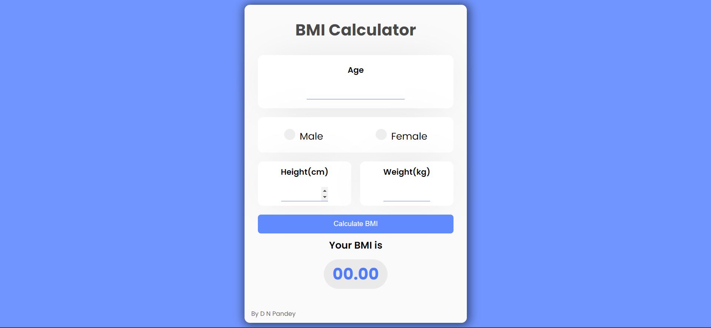

# BMI Calculator

A simple web-based Body Mass Index (BMI) calculator built using HTML, CSS, and JavaScript. This calculator allows users to input their height and weight to calculate their BMI and provides a weight category based on the calculated value.

## Features

- Input height (in cm) and weight (in kg).
- Calculates BMI and displays the result with a weight category:
  - **Underweight**: BMI less than 18.6
  - **Normal range**: BMI between 18.6 and 24.9
  - **Overweight**: BMI greater than 24.9
- Interactive and user-friendly design.

## Demo

You can check out the live demo of the BMI Calculator here:  
[Live Demo](https://digvijaynarayanpandey.github.io/BMI-Calculator/)

## Installation

To use this project locally:

1. Clone the repository:
   ```bash
   git clone https://github.com/your-username/BMI-Calculator.git
   ```
2. Navigate to the project directory:
   ```bash
   cd BMI-Calculator
   ```
3. Open `index.html` in your web browser.

## Usage

1. Enter your height in centimeters and weight in kilograms.
2. Click the **Calculate** button.
3. View your BMI and weight category in the results section.

## File Structure

- **index.html**: The main HTML file for the structure of the app.
- **style.css**: Contains the styling for the app.
- **app.js**: JavaScript logic for calculating BMI and displaying results.

## Screenshots



## Technologies Used

- **HTML**: For the structure of the web page.
- **CSS**: For styling the web page.
- **JavaScript**: For the functionality of the calculator.

## Contributing

If you'd like to contribute to this project, feel free to fork the repository and submit a pull request.

## License

This project is licensed under the MIT License. See the `LICENSE` file for details.